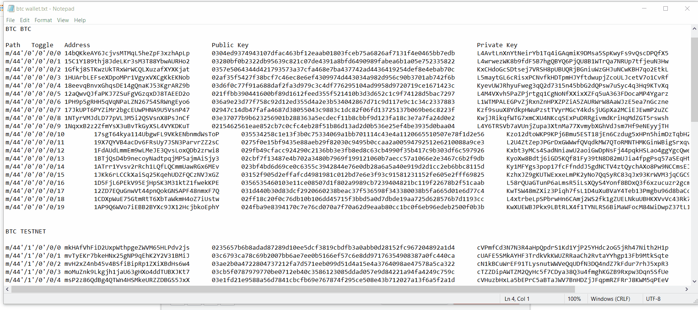
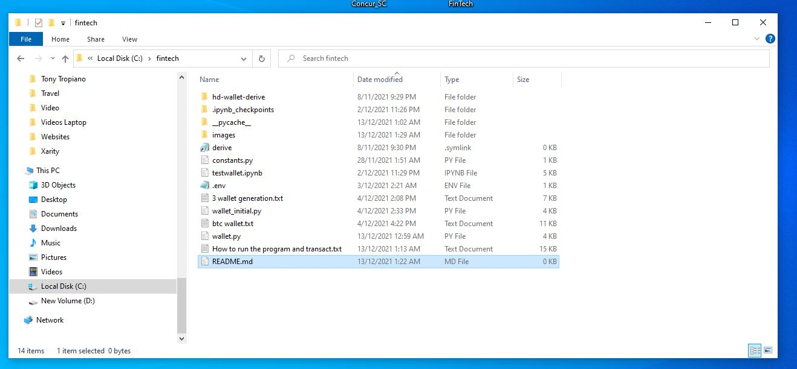

# Multi-Blockchain Wallet in Python

## Background

I created the Multi-Blockchain wallet as per instrutions. This exercise uses a combination of the hd-wallet-derive utility program which is called from within the Python Wallet.py program which I created.

For hd-wallet installation see here 
[hd-wallet installation](HD_Wallet_Derive_Install_Guide.md)

The hd-wallet-derive can create multiple wallet addresses for different cryptos/chains. See here the result of creating wallets for 3 different cryptos/chains

 When you run the Wallet.py program it creates 3 new wallet addresses (or more if you change the variable)for the required cryptos/crypto chains ie BTC, BTCTestnet, ETH.

My Directory structure after the initial startup configuration of the hd-wallet-derive is this

## How to Create Wallets and Transact
The following animated gif show all the procedures taken to create the multi-blockchain wallet and then send a transaction on the BTC Test net using direct commands in my Wallet.py program in Python

    

## Transaction Sent using Python command

Using the first BTC Testnet wallet address "mkHAfVhFiD2UxpWthpgeZWVM65HLPdv2js" I sent a transaction to the same address using the following command :

send_tx(BTCTEST,priv_key_to_account(BTCTEST, "cVPmfCd3N7N3R4aHpQpdrS1Kd1YjP25YHdc2oG5jRh47Nith2H1p"),"mkHAfVhFiD2UxpWthpgeZWVM65HLPdv2js", 0.0000008)

## Proof of Transaction on the BTC Testnet scan/explorer
The 0000008 BTC was sent to the same address. The transaction was finalised and confirmed. Please see here.

 

The procedure for ETH was not done as it wanted to delete node information on my computer which I can not do as I am presenting a blockchain project today and can not risk creating a problem which will affect my whole group.